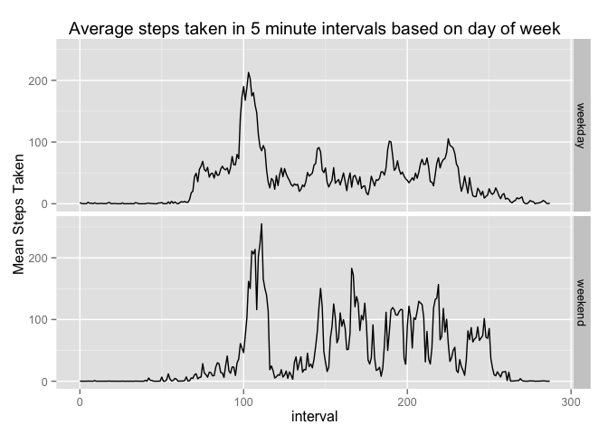

# Reproducible Research: Peer Assessment 1


## Loading and preprocessing the data
The data 

```r
activity<-read.csv('activity.csv')
activity$interval<-activity$interval%/%100*12+activity$interval%%100/5
library(dplyr)
library(ggplot2)
```

```
## Warning: package 'ggplot2' was built under R version 3.1.2
```

## What is mean total number of steps taken per day?
We are ignoring missing values, so na.rm=TRUE in the categories

```r
dailymean<-activity %>% group_by(date) %>% summarise(total=sum(steps, na.rm=TRUE))
hist(dailymean$total, breaks=10, xlab='Total Steps Per Day', main='Histogram of Total Daily Steps Taken')
```

 

```r
mean(dailymean$total, na.rm=TRUE)
```

```
## [1] 9354.23
```

```r
median(dailymean$total, na.rm=TRUE)
```

```
## [1] 10395
```
## What is the average daily activity pattern?

```r
intervalmean<-activity %>% group_by(interval) %>%summarise(mean=mean(steps,na.rm=TRUE))
plot(intervalmean$interval, intervalmean$mean, type='l', xlab='Time Interval', ylab='Average Steps Taken', main='Average Steps Taken during each 5 min time interval')
```

 

Which interval has the maximum

```r
intervalmean[which(intervalmean$mean==max(intervalmean$mean)),1]
```

```
## Source: local data frame [1 x 1]
## 
##   interval
## 1      103
```
## Imputing missing values

```r
sum(is.na(activity$steps))
```

```
## [1] 2304
```
This accounts for 13% of the possible values 
I will fill in the NA values with the mean entry for that specific time interval across all days which is implemented as follows.

```r
naactivity<-merge(activity, intervalmean, by.x='interval', by.y='interval')
#add columns including the mean of the time interval
naactivity$steps[is.na(naactivity$steps)]<-naactivity$mean[is.na(naactivity$steps)]
#replace the NA rows with the mean value
#we would need to sort and remove the extra columns so that the data would be exactly like the original

#make histogram
dailynamean<-naactivity %>% group_by(date) %>% summarise(total=sum(steps))
hist(dailynamean$total, breaks=10, xlab='Total Steps Per Day', main='Histogram of Total Daily Steps Taken')
```

 

```r
mean(dailynamean$total, na.rm=TRUE)
```

```
## [1] 10766.19
```

```r
median(dailynamean$total, na.rm=TRUE)
```

```
## [1] 10766.19
```
Both the mean and median increase from the beginning of the assignment because the missing values are essentially evaluated as 0 because they were ignored. Therefore, when we replace the missing values, we are adding more steps per day which will change the distribution of the daily totals by increasing them, especially on days that were missing several values.

## Are there differences in activity patterns between weekdays and weekends?

```r
naactivity<-mutate(naactivity, weekday=weekdays(as.Date(naactivity$date, format='%Y-%m-%d')))
naactivity$weekday<-as.factor(naactivity$weekday)
levels(naactivity$weekday) <- list(weekday="Monday", weekday="Tuesday",weekday="Wednesday",weekday="Thursday",weekday="Friday",weekend="Saturday",weekday="Sunday")
weekdayint<-naactivity %>% group_by(weekday, interval) %>% summarise(weekmean=mean(steps))
qplot(interval, weekmean, data=weekdayint, facets= weekday~., geom='line', ylab='Mean Steps Taken', main='Average steps taken in 5 minute intervals based on day of week')
```

 

